

    
    <h1>Airflow Debugging Survey 2024 - Report</h1>

The **Airflow Debugging Survey 2024** report reveals key challenges in debugging Apache Airflow.
Users struggle with vague error messages and unclear logs, highlighting a need for improved clarity and control.

### Key Insights:

- Error Messages - Some users find them vague and confusing.

- Stack Traces - There’s a demand for better verbosity control and context.

- Log Readability - Enhanced readability and search features are needed.

- Tool Integration - Better integration with modern debugging tools is desired.

- DAG Complexity - Complicated deployment hinders effective debugging.

### Quantitative Insights:

- Stack Trace Difficulty - 55.2% respondents find stack traces challenging.

- Error Message Clarity - 41.7% respondents don't consider error messages as actionable.

- External Tool Use - 44.8% "Often" or "Always" rely on external tools.

- Remote Debugging Issues - 68% struggle in remote environments.

- Error Handling Improvements - 48.3% of respondents chose early issue detection during execution as one of their top 2 choices.

- Time-Consuming Tasks - "Iteration" (by 50% respondents) and "Integration" (by 31% respondents) are the 2 most time-consuming activities during DAG development.

# Q1.1. What issues have you encountered with Airflow logs?

    
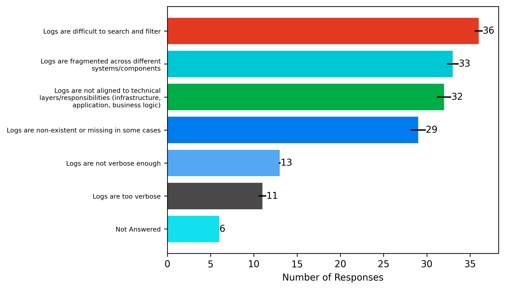
    

# Q1.2. What challenges have you been facing with Airflow's stack traces?

    
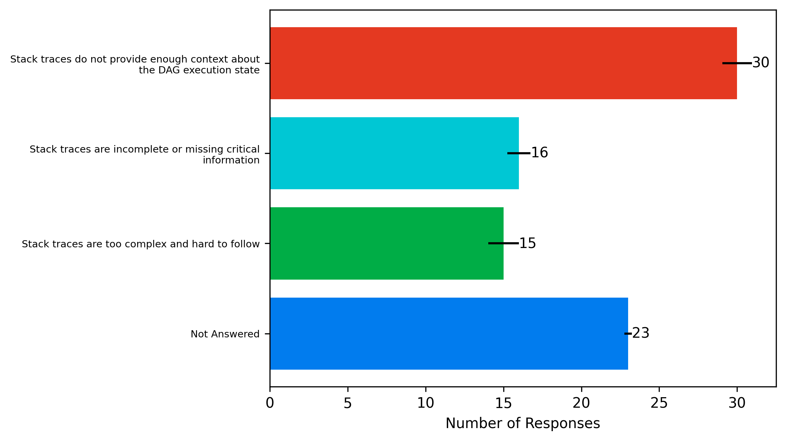
    

# Q1.2.1. Other challenges:

### DAG Parsing Issues:

- Some DAGs that run successfully as Python files are not parsed correctly by the DAG processor.

### Stack Trace Effectiveness:

- Generally, stack traces are helpful and point to the right locations in the source code, especially when tasks are executed within the Airflow layer.

### Stack Trace Control:

- Desire for more control over stack trace verbosity, possibly through a configurable property to adjust the length.

### Error Clarity:

- Frustration with vague errors like "Celery command failed on host," which are often linked to DAG processor timeouts.

### Complexity in Scheduler and Webserver Interaction:

- Difficulty connecting the scheduler and webserver due to a lack of visual trace information from the scheduler.

### Incomplete Stack Traces:

- Stack traces do not always show the full path of the source file, which can lead to confusion with files that have the same name across installed packages.

- Stack traces for failing DAGs often lack complete information when displayed in the UI's red error bar.

# Q1.3. How would you rate the ease of understanding stack traces in Airflow?

    
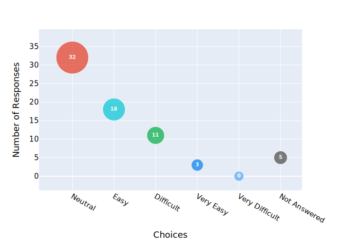
    

# Q1.4. What improvements to Airflow’s traceback information would make debugging easier?

### Log Readability and Features:

- Implement color coding based on criticality to enhance log readability.

- Improve log searching and readability using colors and UI features.

### Error Clarity:

- Multiple exceptions can confuse users; clearer presentation is needed.

- Stack traces are generally helpful but can be misleading when they arise from dependency conflicts after upgrades.

### Feedback Suggestions:

- Highlight hyperlinks in logs (e.g., links to Spark jobs) and color code error logs for better visibility.

- Provide a one-liner explanation of errors and create separate error pages with filters and detailed visual presentations.

### DAG Context in Errors:

- Include the parsed version of the DAG during errors to clarify the state of the code at the time of failure, especially if the DAG has been updated.

### DAG Execution State:

- Elaborate on DAG execution states beyond just the log line that failed; more context about checks at the time of the failure is needed, particularly in the scheduler.

### Stack Trace Improvements:

- Provide dependency tracking in stack traces, showing upstream and downstream tasks and their states.

- Automatically dump relevant variables and environment states at the time of failure, including task parameters and Airflow configurations.

- Add time information to stack traces, detailing the time spent on different operations within a task.

### Failure Warnings:

- Include warnings in tracebacks for steps that take unusually long before failing, such as long-running database queries.

# Q1.4.1. Potential improvements:

    
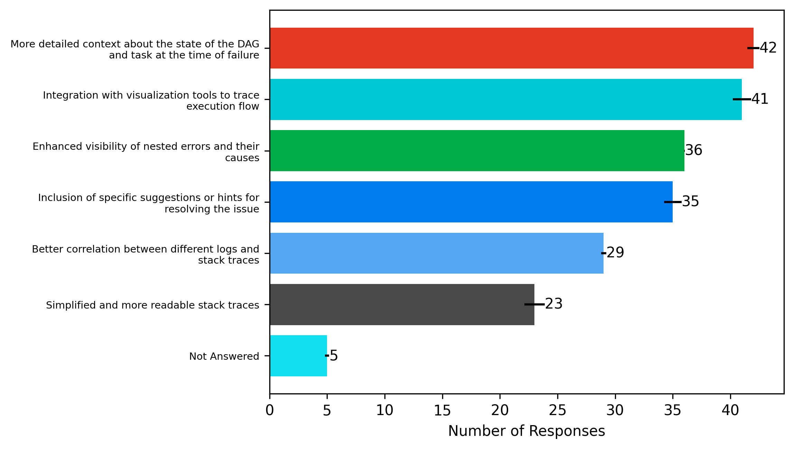
    

# Q2.1. What issues have you encountered with Airflow error messages?

    
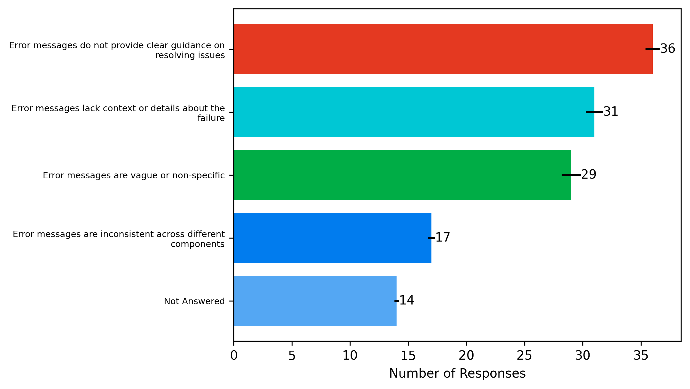
    

# Q2.2. How would you rate the clarity & actionability of Airflow error messages?

    
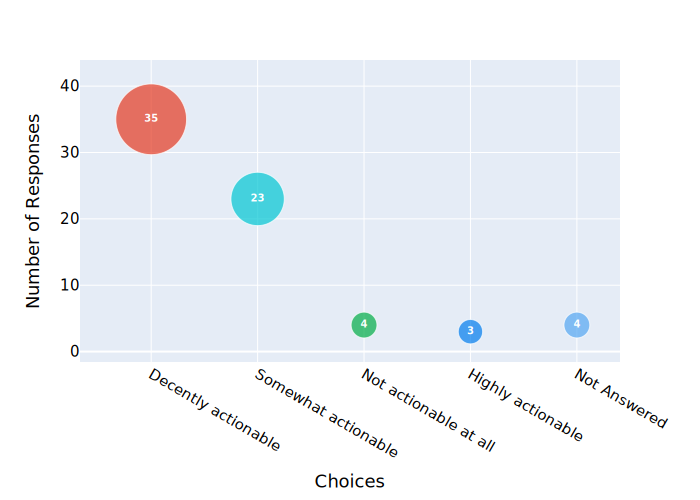
    

# Q2.3. Which of the following suggestions would improve Airflow's error handling?

    
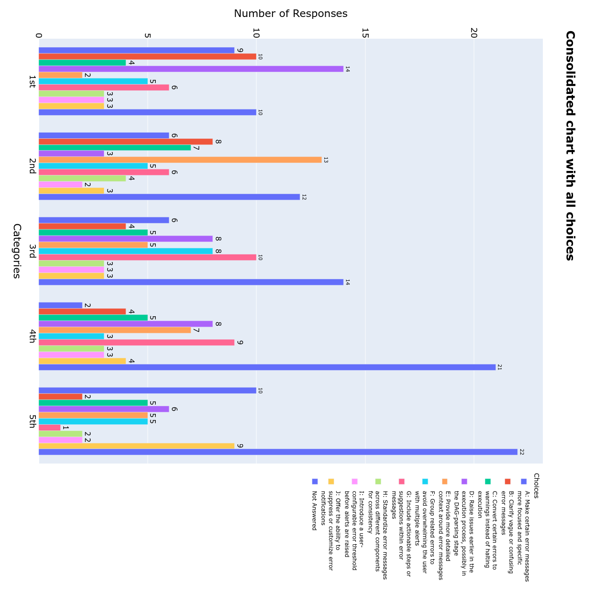
    

# Q3.1. Which tools do you use to develop Airflow DAGs?

    
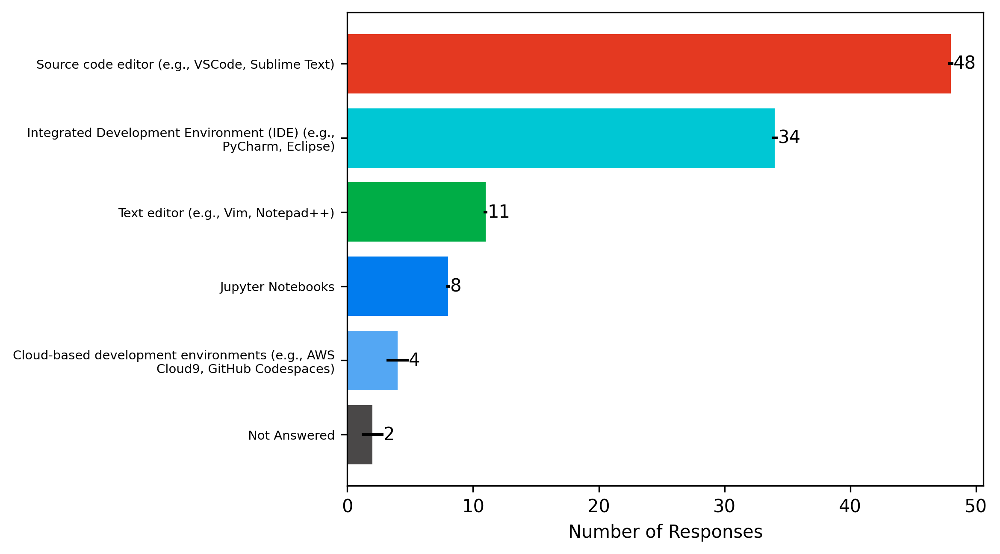
    

# Q3.2. How satisfied are you with Airflow’s integration with modern debugging tools and the related documentation?

    
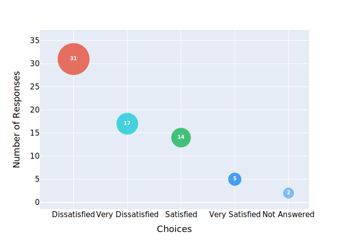
    

# Q3.3. How often do you use external tools (i.e. besides Airflow's API, UI, and CLI) to supplement Airflow's debugging capabilities?

    
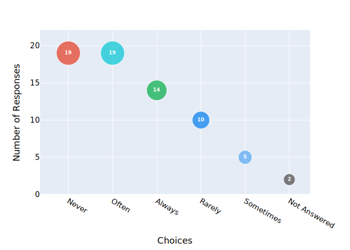
    

# Q3.4. What sort of external tools do you use in conjunction with Airflow for debugging?

    
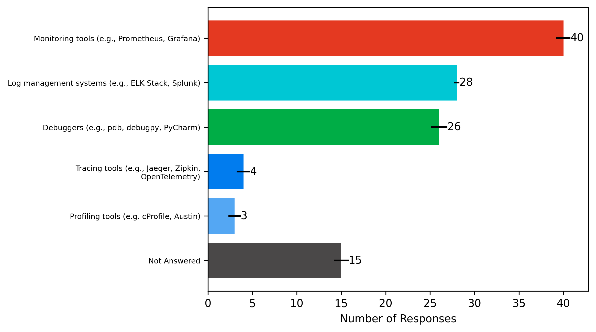
    

# Q3.5. What integrations or tooling improvements would you like to see in Airflow to enhance your debugging experience?

### Remote Debugging:

- Easier and better-documented attachment to remote Airflow instances.

- Support for remote debugging of tasks through VS Code.

- Full debugging of Airflow DAGs from start to finish.

### Local Development and Debugging:

- Improved ease of running Airflow locally and integrating with the VS Code debugger.

- Support for debugging containerized Airflow stacks using Docker Compose.

### Connection Improvements:

- Transition from TCP to HTTP connections for better robustness between remote workers and the cloud.

### Cluster Activity Tab:

- Potential for enhanced overview capabilities of all DAGs within the cluster activity tab.

### Variables and Connections Documentation:

- Need for clearer documentation on setting up Airflow variables and connections for debugging (e.g., during dag.test() sessions) with various formats (CLI, YAML, JSON, etc.).

### VS Code Extensions:

- Extension for parsing DAGs and improved integrations with log management tools (e.g., logz.io) and monitoring tools.

### Debugging Support:

- More robust support for debugging, considering the tightly coupled nature of Airflow that complicates debugging without a fully initialized environment.

### IDE Features:

- Desktop IDE debugging support in VS Code and a specific PyCharm plugin for Airflow testing and debugging.

- Linting and formatting tools, as well as a PyCharm plugin for DAG integrity testing and visualization.

### Online IDE Functionality:

- Online IDE or developer mode for adding debuggers and breakpoints on the fly.

### Memory Monitoring:

- Tools to accurately monitor memory usage on a task-by-task basis.

### Kubernetes Debugging:

- Improved tooling for attaching debuggers to Kubernetes pods in local development environments.

### Testing Improvements:

- Desire for testing tasks as standalone methods without the Airflow wrapper complicating the process.

### Feedback and Features:

- Integration with remote debuggers for live environments, and a built-in task-level debugging console within the Airflow UI to inspect task states and outputs.

### Local Airflow Enhancements:

- Better support for running Airflow locally, including 'airflow standalone' functionality with MySQL or PostgreSQL, similar to SQLite, to avoid concurrency issues.

# Q3.6. Which of the following code assistance and inspection tools do you use while developing Airflow DAGs?

    
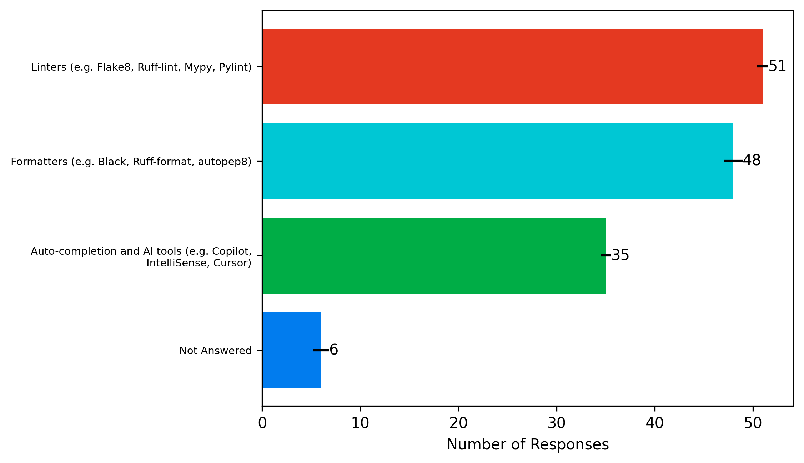
    

# Q4.1. What is the most time-consuming activity related to developing new DAGs?

    
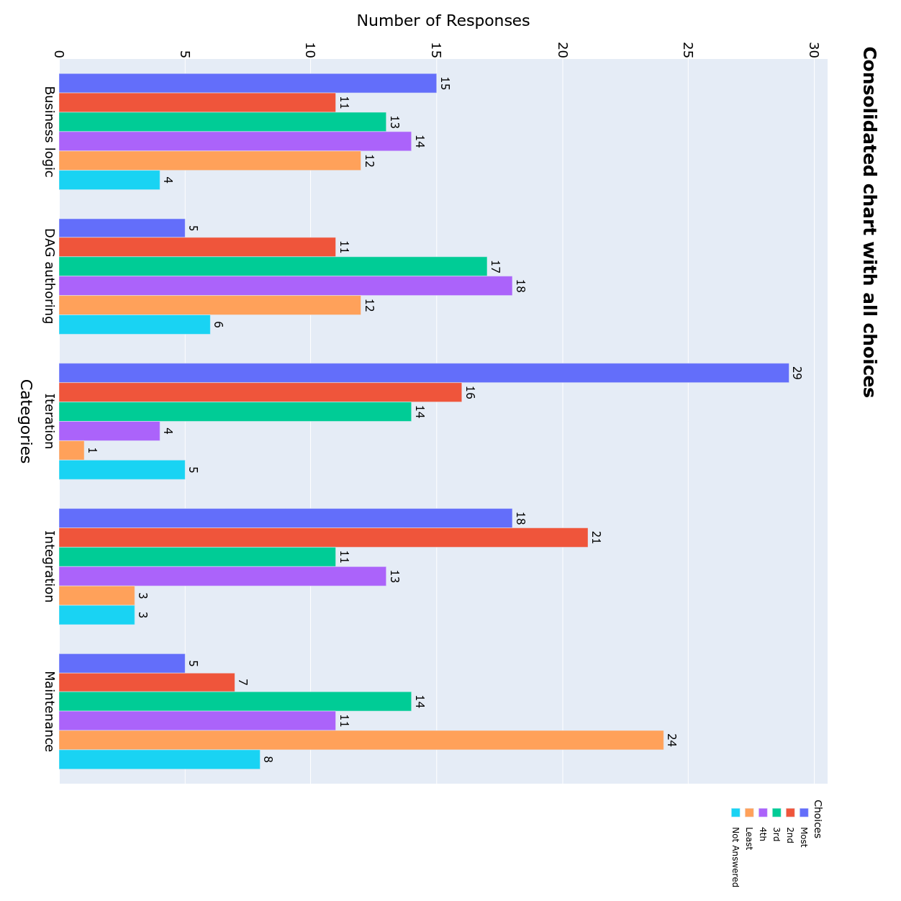
    

# Q4.2 What can be improved about the workflow activities mentioned above?

### DAG Maintenance:

- Enhancements needed for maintaining DAGs, such as lint warnings for file saving operations without checking folder existence.

### Simplified DAG Management:

- Easier processes for uploading new DAGs, clearing specific tasks, rerunning them, and viewing logs with a single IDE command. Immediate DAG parsing when changes occur.

### Local Development and Debugging:

- Improvements required for local execution and debugging with IDEs like VS Code.

### Documentation:

- Better documentation for integration, explaining different parameters with examples.

### DAG Modification in UI:

- Support for temporary DAG modifications in the Airflow UI for debugging and testing.

### Log Export:

- Ability to export logs to Kafka.

### API Connection Automation:

- Interface to automate connections to API endpoints and load data similarly to tools like Airbyte or River.io.

### Handling Variables and Connections:

- Difficulties working with variables and connections during debug sessions due to inconsistent documentation and formats across the Airflow CLI and other tools.

### Docker-Compose Performance:

- Docker-compose is slow; finding a better alternative would improve development cycles. Parsing DAGs is particularly challenging.

### Testing and Mocking:

- Need for easier mocking, integration testing, and unit testing of Airflow components.

### High-Level DAG Navigation:

- Ability to step through the DAG at a high level without complex debugging setups.

### Feedback Loop Optimization:

- Anything to speed up the feedback loop is desired.

### Connection Parameter Clarity:

- Spending significant time figuring out connection parameters.

### DAG Simulation and Testing:

- Easier methods to test or simulate DAG runs or individual task instances.

### IDE Plugin:

- An official Airflow plugin for standard editors/IDEs to support autocompletion and documentation viewing.

### YAML for Simple DAGs:

- Suggestion to use YAML and forms for creating simple DAGs.

### External Resource Handling:

- Improving task relationships with external resources to allow easier testing.

### Local Development Support:

- Better support for fully local development workflows, leading to quicker iteration through local DAG execution.

### General Feedback Suggestions:

- Built-in support for simulating DAG inputs (e.g., data_interval_start, execution_date).

- Pre-built DAG templates for common patterns to streamline authoring.

- Visual DAG authoring tools for graphical task management to reduce errors and enhance understanding.

# Q4.3. How often do you leave the Airflow UI or CLI (and rely on external tools) to achieve each of the above?

    
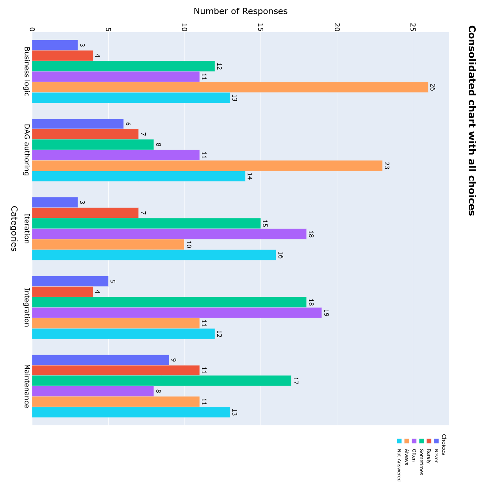
    

# Q4.4. Which of the following additions to the Airflow UI could be useful to your debugging efforts?

    
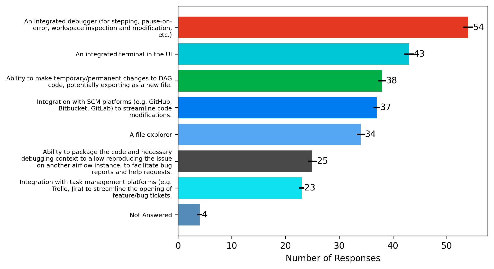
    

# Q4.4.1. Other suggestions:

### Local Development and Debugging:

- Easier local execution and integration with IDE debuggers like VS Code.

- Task instance view should allow easy copying of Airflow task test config parameters, as these are often needed in the IDE.

### Log Access and Backfilling:

- Provide access to logs for tasks that no longer exist in the DAG interface.

- Implement a UI for backfilling, as CLI access is not available to all users.

- Enhance support for debugging Airflow in Docker using VS Code/Codium.

### File Management:

- A file explorer for logs and DAGs with editing capabilities would simplify fixing small bugs.

### Web UI Code Editing:

- Desire for a code editor within the web UI.

### GitHub Integration:

- Direct integration with GitHub for version control.

### DAG Deployment Process:

- Current DAG deployment process is cumbersome, involving uploads to cloud storage and syncing changes in Airflow pods, which can be confusing for developers.

- Clarification needed on whether changes affect task execution (requiring worker pod sync) or DAG execution (requiring scheduler pod sync), leading to lengthy iteration cycles.

- The typical iteration cycle includes uploading, waiting for changes to sync, and then testing, which can be time-consuming.

# Q4.5. What could make DAG.test() more useful?

    
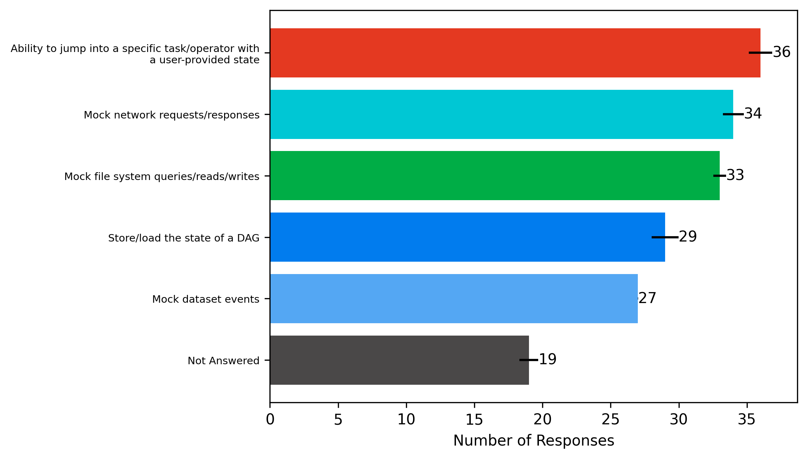
    

# Q4.5.1. Other suggestions:

### Variable Directory Integration:

- Suggestion to integrate with the variables directory.

### Mock Cloud Environment:

- Need for a mock cloud environment to simulate service credentials and principals not available locally.

### DAG Testing Usage:

- Observations that DAG.test is rarely utilized; preference for launching an Airflow instance for testing.

### Task Concurrency:

- Desire for task concurrency support for larger DAGs, emphasizing that this requires a database other than SQLite.

# Q4.6. What kind of remote Airflow environment(s) do you use?

    
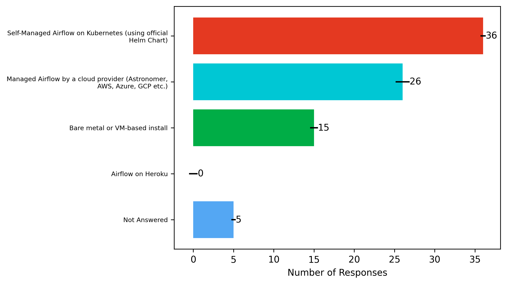
    

# Q4.7. How would you rate the ease of debugging DAGs in a remote Airflow environment (Kubernetes, Docker, etc.)?

    
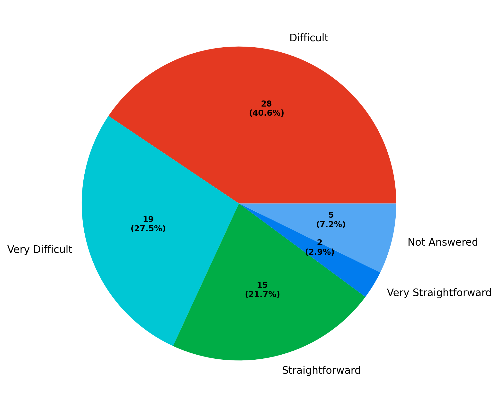
    

# Q4.7.1. What can make debugging a remote Airflow deployment easier or more efficient?

### Debugger Integration:

- Improved documentation on attaching debuggers to DAG runs, with step-by-step instructions for VS Code and PyCharm.

- Option to delay execution until a debugger is attached.

### APIs for IDE Extensions:

- APIs to allow IDEs to upload DAGs, force re-parsing, set debug breakpoints, stream logs, and fetch remote debugger endpoints for VS Code.

### Data Export:

- Ability to export statistics to CSV for easier analysis of DAG runs and task instances.

### VS Code/Codium Support:

- Enhanced support for VS Code/Codium, including an integrated console for inspecting environment variables and the file system.

### Monitoring and Logging:

- Better monitoring of resource consumption with clearer error messages.

- Built-in debugger with breakpoint functionality.

### Remote Access Limitations:

- Acknowledgment that some providers disallow remote debugging and shell access, highlighting the potential utility of an integrated terminal/file browser.

### Documentation and Awareness:

- Need for clearer documentation regarding capabilities, especially in environments without CLI access (e.g., MWAA).

### Feedback Loop Improvements:

- Features to speed up development, like running individual tasks instead of entire DAGs, per-DAG log level settings, and terminal sessions for debugging through the Airflow UI.

### Kubernetes-Specific Feedback:

- Request for pod-wise diagnostics in the Cluster Activity page for easier monitoring without using kubectl.

### Task Instance Breakpoints:

- Ability to set breakpoints when executing task instances.

### DevContainers:

- Inquiry about the use of DevContainers.

### Airflow UI Editor:

- Providing an editor in the Airflow UI that reflects changes and commits to the respective repository.

### XCom Integration:

- Improving XComs to better integrate with external resources, allowing easy access to data from locations like Snowflake or S3.

### DAG Parsing Speed:

- Faster DAG parsing with real-time updates upon changes.

# Q5.1. How would you describe your proficiency level with Airflow?

    
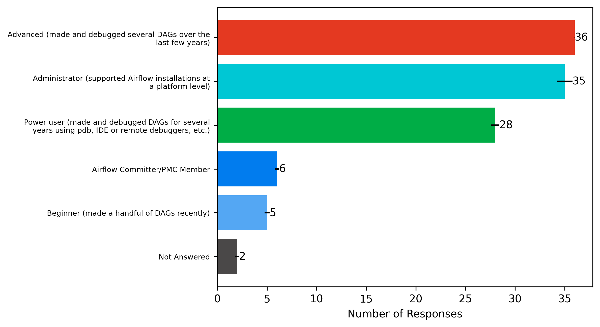
    

# Q5.2. What are your responsibilities in the context of using Airflow?

    
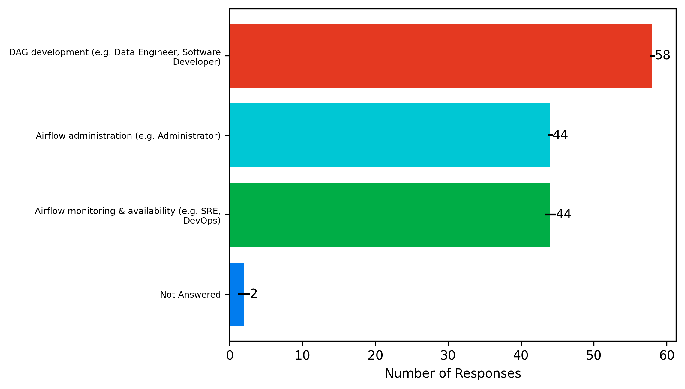
    

# Q5.3. How would you describe your role in the context where you use Airflow most often?

    
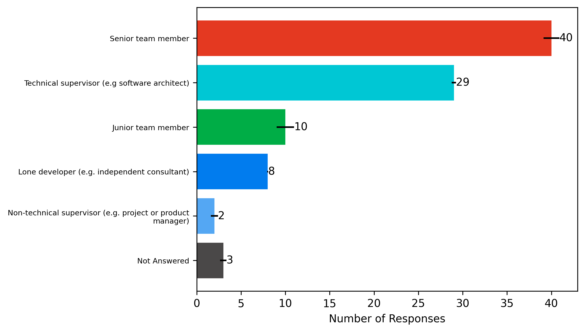
    

# Q6.1. Free-form feedback summary

### Debugging Enhancements:

- Ability to save, share, and restore debugging sessions.

- Easier local execution and integration with IDE debuggers like VS Code.

### DAG Management:

- Implement mechanisms for real-time DAG updates and testing.

- Improve integration with OpenTelemetry and enhance the statistics being sent.

### Integration Testing Resources:

- Desire for a repository of mocks, Docker Compose setups, and sample Pytests for integration testing, ideally hosted in the Astronomer Registry.

### Web UI Improvements:

- Code editor functionality in the web UI for direct editing and testing.

- Increased trigger rules.

- Ability to edit XComs from the UI.

- Options to stop, pause, and resume tasks (currently only failed, success, and clear are available).

- Dynamic scaling of mapped tasks even after they have started.

- Access to running logs for tasks.

### Appreciation:

- General thanks for making Airflow a great product!

